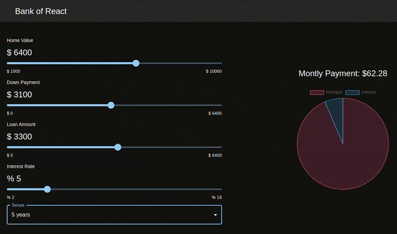

# Practice React building a Mortgage Calculator

[Tutorial by Joy Shaheb from freeCodeCamp](https://www.freecodecamp.org/news/react-mortgage-calculator-tutorial-for-beginners/)

[Final work](https://mortgage-calculator-khaki.vercel.app/)

